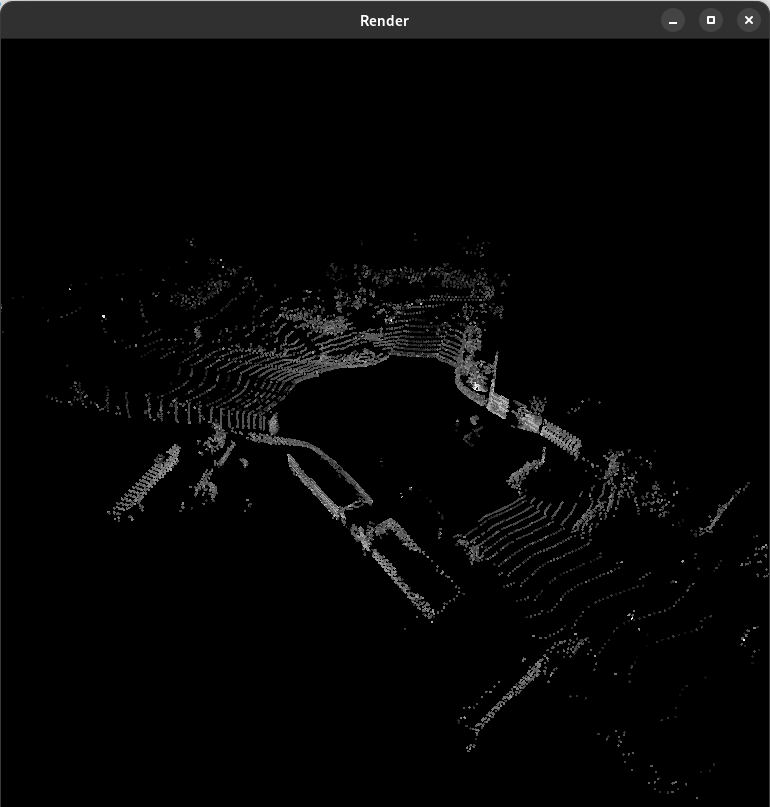

# simple_pc_viewer



## Installation & Run

```shell
# Install dependencies
pip install -r requirements.txt
# Run with
python viewer.py data/pc.npy --labels data/labels.npy --color_map data/color_map.yaml --decimate 10
python viewer.py data/waymo_pc.npy --box_labels data/waymo_labels.npy --decimate 10
```
